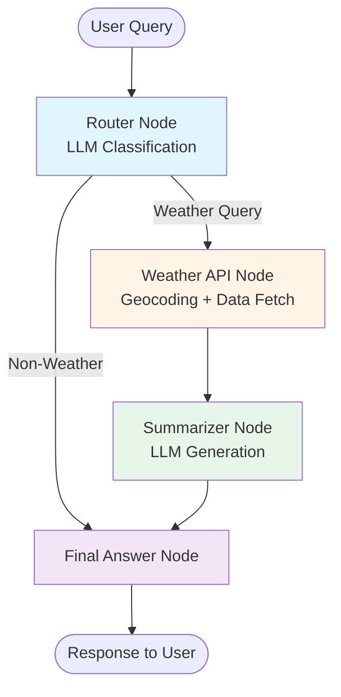

# Multi-Agent Weather Assistant with LangGraph & Gemini

A production-ready intelligent weather assistant built using **LangGraph** for multi-agent orchestration and **Google's Gemini** for natural language understanding. This project demonstrates how to build a sophisticated AI agent that classifies queries, fetches real-time weather data, and generates human-friendly responses.

## 🌟 Features

- **LLM-Powered Query Classification**: Uses Gemini to intelligently determine if a query is weather-related and extract location information
- **Multi-Agent Architecture**: Implements a clean router → API → summarizer → response pipeline using LangGraph
- **Real-Time Weather Data**: Integrates with Open-Meteo API for accurate, up-to-date weather information
- **Natural Language Generation**: Transforms raw weather data into conversational, user-friendly responses
- **Robust Error Handling**: Fallback mechanisms for ambiguous queries and API failures
- **LangSmith Integration**: Built-in tracing for debugging and monitoring agent behavior

## 🏗️ Architecture



### Agent Flow

1. **Router Agent** (LLM): Classifies intent + extracts location
2. **Weather API Agent**: Geocodes location → fetches weather data
3. **Summarizer Agent** (LLM): Converts structured data → natural language
4. **Final Answer Agent**: Returns formatted response

## 🚀 Quick Start

### Prerequisites

```bash
pip install langgraph langchain-core google-genai requests
```

### Setup

1. **Get API Keys**:
   - Gemini API Key from [Google AI Studio](https://makersuite.google.com/app/apikey)
   - (Optional) LangSmith API Key from [smith.langchain.com](https://smith.langchain.com)

2. **Configure Environment**:

```python
GEMINI_API_KEY = 'your-gemini-api-key'
os.environ["LANGCHAIN_TRACING_V2"] = "true"  # Optional
os.environ["LANGCHAIN_API_KEY"] = "your-langsmith-key"  # Optional
```

3. **Run the Agent**:

```python
from weather_agent import build_weather_app

app = build_weather_app()
result = app.invoke({"user_input": "What's the weather in Seattle?"})
print(result["answer"])
```

## 📋 Example Queries

```python
✅ "What's the weather in Seattle?"
✅ "Tell me the weather in Hyderabad right now"
✅ "How's the weather in Tokyo today?"
❌ "Do you like pizza?" → "I can only answer weather questions..."
```

## 🧪 Testing

Run the included test suite:

```python
test_cases = [
    "What's the weather in Seattle right now",
    "Tell me the weather in Hyderabad.",
    "How's the weather today?",
]

for query in test_cases:
    result = app.invoke({"user_input": query})
    print(f"Q: {query}\nA: {result['answer']}\n")
```

## 🛠️ Tech Stack

| Component | Technology |
|-----------|-----------|
| **LLM** | Google Gemini 2.0 Flash |
| **Orchestration** | LangGraph (StateGraph) |
| **Weather API** | Open-Meteo |
| **Geocoding** | Open-Meteo Geocoding |
| **Monitoring** | LangSmith (optional) |

## 📊 State Management

The agent maintains a shared `WeatherState` across all nodes:

```python
class WeatherState(TypedDict):
    user_input: str      # Original query
    is_weather: bool     # Classification result
    location: str        # Extracted location
    weather_info: str    # Raw API response
    answer: str          # Final formatted answer
```

## 🔧 Customization

### Add New Agents

```python
def custom_node(state: WeatherState) -> WeatherState:
    # Your logic here
    state["custom_field"] = "value"
    return state

builder.add_node("custom", custom_node)
builder.add_edge("router", "custom")
```

### Change LLM Provider

Replace Gemini calls with OpenAI, Anthropic, or any LangChain-compatible LLM:

```python
from langchain_openai import ChatOpenAI

llm = ChatOpenAI(model="gpt-4")
response = llm.invoke(prompt)
```

## 🐛 Debugging

Enable detailed logging:

```python
import logging
logging.basicConfig(level=logging.DEBUG)

# Or use LangSmith for visual debugging
os.environ["LANGCHAIN_TRACING_V2"] = "true"
```

## 📈 Future Enhancements

- [ ] Add multi-day forecasts
- [ ] Support weather alerts/warnings
- [ ] Implement conversation memory
- [ ] Add support for multiple locations in one query
- [ ] Build a Gradio/Streamlit UI
- [ ] Add unit tests with pytest

## 🤝 Contributing

Contributions welcome! Please:

1. Fork the repo
2. Create a feature branch (`git checkout -b feature/amazing-feature`)
3. Commit changes (`git commit -m 'Add amazing feature'`)
4. Push to branch (`git push origin feature/amazing-feature`)
5. Open a Pull Request

## 📝 License

MIT License - see [LICENSE](LICENSE) for details

## 🙏 Acknowledgments

- [LangGraph Documentation](https://langchain-ai.github.io/langgraph/)
- [Google Gemini API](https://ai.google.dev/)
- [Open-Meteo Weather API](https://open-meteo.com/)

---

**Built with ❤️ using LangGraph and Gemini**
