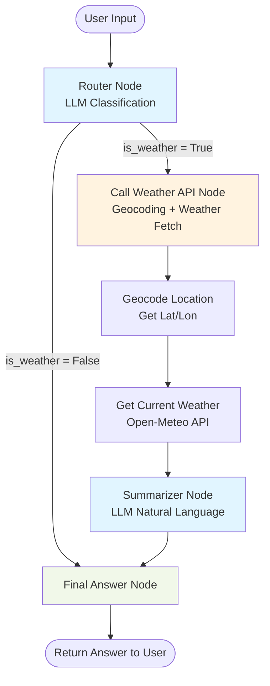
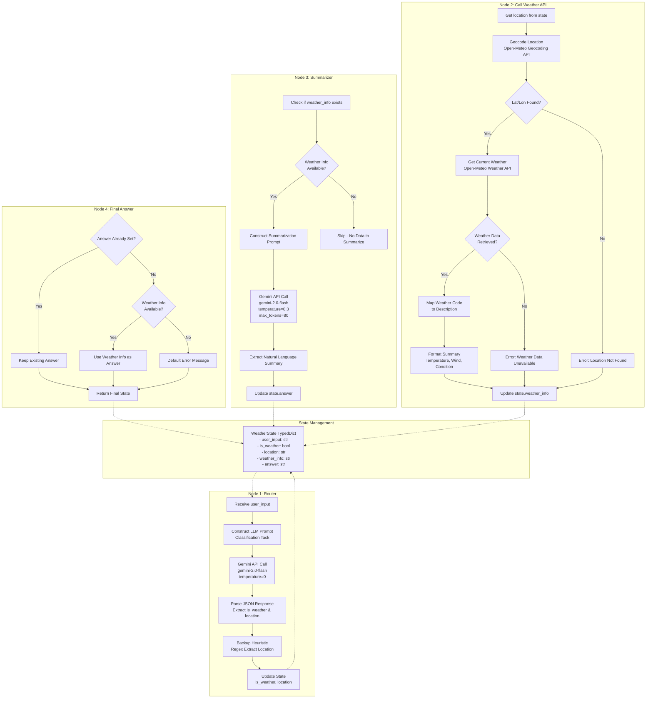
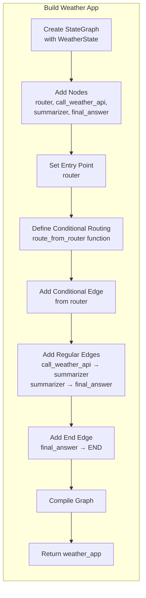
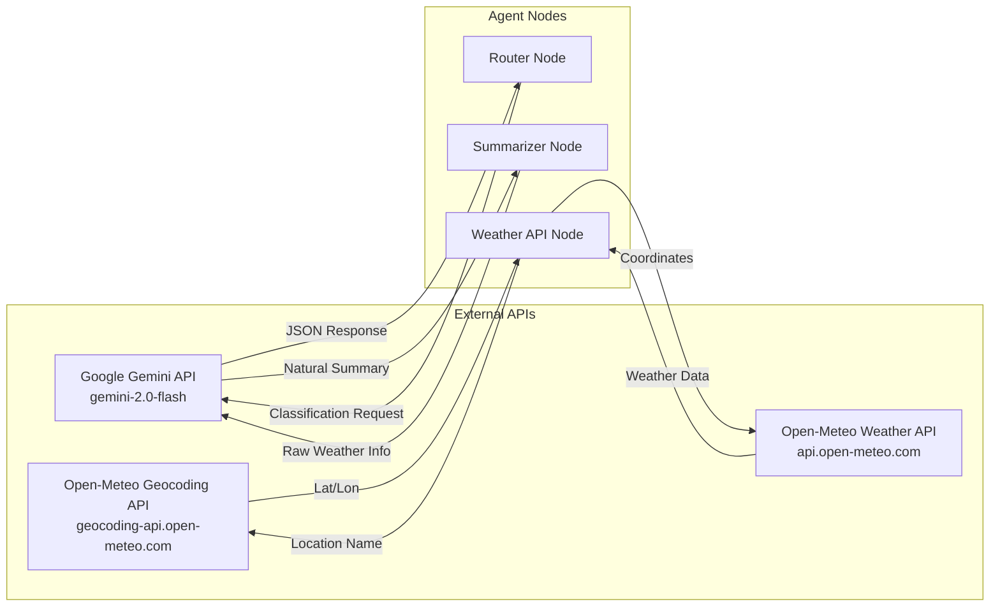
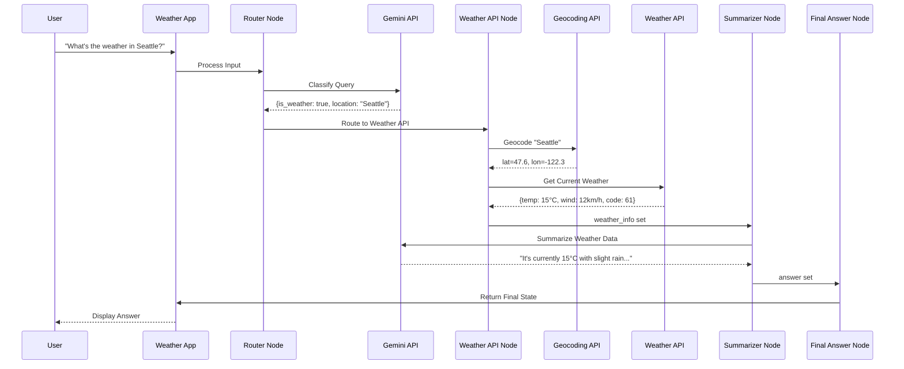

# Weather Agent Architecture - Mermaid Flowchart

## Overall Flow Diagram

## Detailed Component Architecture

## Graph Construction Flow

## API Integrations

## Execution Flow Example

## Key Features

### 1. State Management
- **TypedDict Schema**: Strongly typed state shared across all nodes
- **Partial State Updates**: Each node modifies only relevant fields
- **Total=False**: Optional fields for flexible state evolution

### 2. LLM Integration (Gemini)
- **Router Classification**: JSON-structured output for reliable parsing
- **Temperature Control**: 0 for classification, 0.3 for summarization
- **Fallback Handling**: Regex-based backup when JSON parsing fails

### 3. External API Integration
- **Geocoding**: Convert location names to coordinates
- **Weather Data**: Real-time weather from Open-Meteo
- **Error Handling**: Graceful degradation on API failures

### 4. Graph Architecture (LangGraph)
- **Conditional Routing**: Decision-based flow control
- **Linear Pipelines**: Sequential processing for weather queries
- **State Compilation**: Immutable compiled graph for execution

### 5. Natural Language Generation
- **Structured → Natural**: Convert API data to friendly text
- **LLM-Powered**: Context-aware summarization
- **Concise Output**: Token-limited responses

## Configuration

| Component | Model/Service | Key Parameters |
|-----------|---------------|----------------|
| Router Node | gemini-2.0-flash | temp=0, max_tokens=100 |
| Summarizer Node | gemini-2.0-flash | temp=0.3, max_tokens=80 |
| Geocoding API | Open-Meteo | count=1, timeout=5s |
| Weather API | Open-Meteo | current_weather=True |
| Graph Engine | LangGraph | StateGraph + END |
